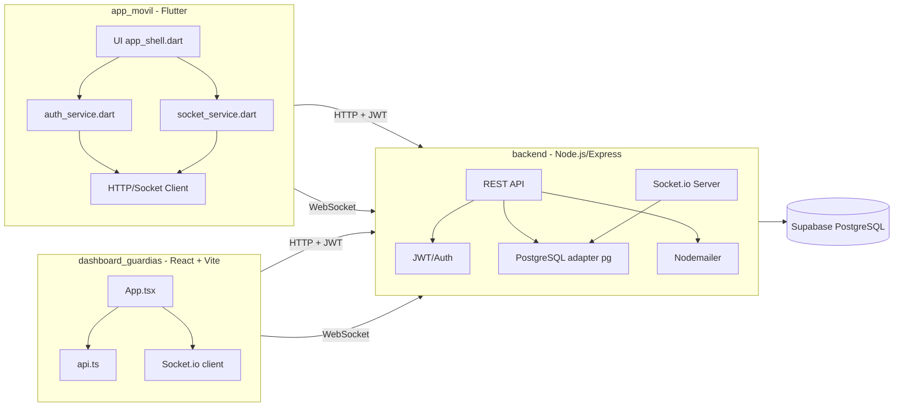
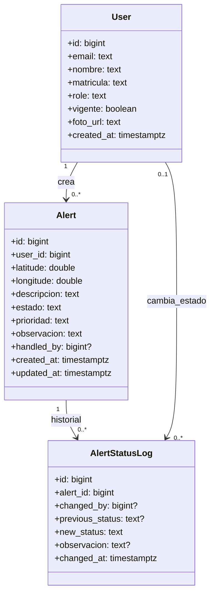
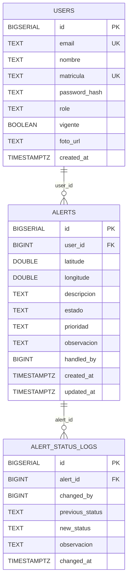

# UML y Modelado BD (Supabase) - OnAlert

Guia practica para documentar la arquitectura de la aplicacion y el modelo de datos.

## 1) Diagrama UML de componentes del sistema



## 2) UML de clases/logica de dominio (alto nivel)



## 3) ERD del modelo de base de datos (Supabase)



## 4) Como obtener el diagrama desde Supabase (real, no manual)

### Opcion A: SQL para documentar tablas/relaciones

Ejecuta en Supabase SQL Editor:

```sql
select
  tc.table_name,
  kcu.column_name,
  ccu.table_name as foreign_table_name,
  ccu.column_name as foreign_column_name
from information_schema.table_constraints tc
join information_schema.key_column_usage kcu
  on tc.constraint_name = kcu.constraint_name
join information_schema.constraint_column_usage ccu
  on ccu.constraint_name = tc.constraint_name
where tc.constraint_type = 'FOREIGN KEY'
  and tc.table_schema = 'public'
order by tc.table_name, kcu.column_name;
```

Y para columnas:

```sql
select
  table_name,
  column_name,
  data_type,
  is_nullable,
  column_default
from information_schema.columns
where table_schema = 'public'
order by table_name, ordinal_position;
```

### Opcion B: DBML para dbdiagram.io

1. Exporta esquema desde Supabase (CLI o SQL dump).
2. Convierte a DBML.
3. Pega el DBML en dbdiagram.io para generar ERD visual.

### Opcion C: Mermaid dentro del repo (recomendado para versionado)

1. Mantener este archivo versionado en Git.
2. Cada cambio de migracion actualiza la seccion `ERD`.
3. Revisar en PR junto con cambios de backend.

## 5) Convenciones recomendadas para OnAlert

- Usa `snake_case` en tablas/columnas SQL y `camelCase` en API.
- Declara FK explicitas tambien para `alerts.handled_by` y `alert_status_logs.changed_by` si quieres integridad total.
- Agrega indices para consultas operativas:

```sql
create index if not exists idx_alerts_estado_created_at
  on alerts (estado, created_at desc);

create index if not exists idx_alerts_prioridad_created_at
  on alerts (prioridad, created_at desc);

create index if not exists idx_alert_status_logs_alert_id_changed_at
  on alert_status_logs (alert_id, changed_at desc);
```

## 6) Checklist rapido para mantener UML al dia

- Cambio en endpoint o servicio => actualiza diagrama de componentes.
- Cambio en entidades de dominio => actualiza UML de clases.
- Cambio en migraciones SQL => actualiza ERD y constraints.
- PR no se mergea si diagrama y codigo no coinciden.

## 7) Generacion automatica desde este documento

Script disponible:

- `scripts/generate_mermaid_diagrams.ps1`

Comandos:

```powershell
cd c:\Users\Radic\OneDrive\Escritorio\OnAlert

# Genera archivos .mmd en docs/diagrams
./scripts/generate_mermaid_diagrams.ps1

# Genera .mmd + .svg
./scripts/generate_mermaid_diagrams.ps1 -Render -Formats svg

# Genera .mmd + .svg + .png
./scripts/generate_mermaid_diagrams.ps1 -Render -Formats svg,png
```

Salida esperada:

- `docs/diagrams/01-diagrama-uml-de-componentes-del-sistema.mmd`
- `docs/diagrams/02-uml-de-clases-logica-de-dominio-alto-nivel.mmd`
- `docs/diagrams/03-erd-del-modelo-de-base-de-datos-supabase.mmd`

Nota: para renderizar imagenes necesitas Mermaid CLI instalado globalmente:

```powershell
npm i -g @mermaid-js/mermaid-cli
```
